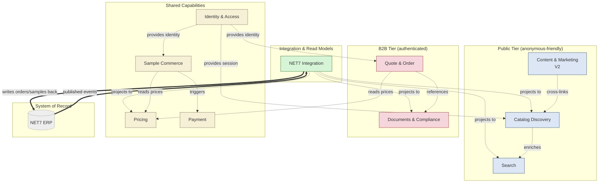
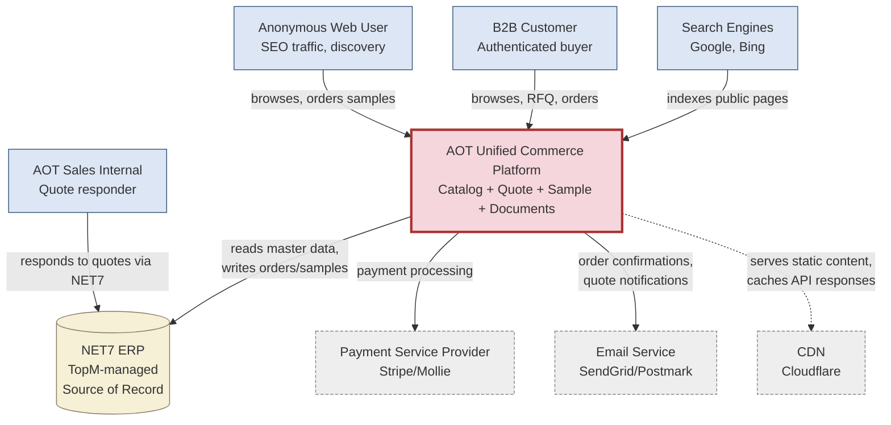
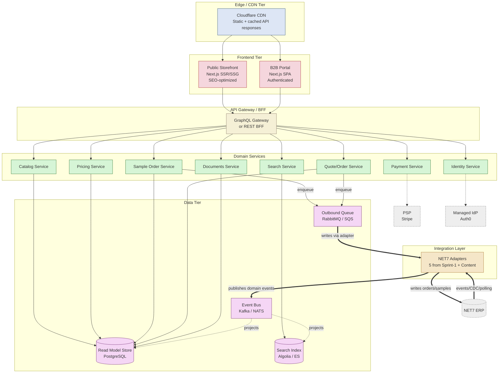

# AOT Unified Commerce Platform — Strategic Architecture Foundation
## Principal-Architect Document for Sprint-2 Mandate

**Mandate:** Build a seamless one-stop digital customer experience where users do not distinguish between website, product catalog, webshop, or customer portal.

**Mental Model:** Amazon Business + ERP Integration + Industrial B2B Procurement

**Status:** Strategic Proposal — requires AOT/TopM Discovery validation before commitment.

**Foundation:** Builds on Sprint-1 (5 Aggregate-Sketches, 3 ADRs, 46 OQs, 18 MDR-Risks, Adapter-Topology).

---

# §0 Executive Summary

AOT's current portal couples NET7 directly to authenticated B2B traffic via server-rendered session pages. The new mandate requires **public discovery + indexability + anonymous sample purchase + customer-specific B2B experience** — all from the same product master in NET7.

**The fundamental tension:** NET7 is a **system of record** optimized for ERP transactions. Public web traffic demands a **system of engagement** optimized for read-heavy, low-latency, search-driven, edge-distributed access. **These cannot be the same system.**

**Recommendation:** Adopt a **read-model architecture** with NET7 as authoritative source, fed via event-driven replication into purpose-built layers (Catalog/Search/Pricing/Identity/Experience), each optimized for its access pattern.

**Critical strategic shift:** Sprint 1 modeled aggregate-by-aggregate (correct). Sprint 2 must model **layer-by-layer with cross-cutting concerns** (read models, caching, eventual consistency, identity). The aggregate model is the **internal vocabulary** — the layer model is the **deployment topology**.

---

# §1 Critical Assumption Challenge

Before architecture, the mandate's assumptions must be tested. Each below is a place where the stated goal may need refinement.

## Challenge 1.1 — "Same experience for anonymous + authenticated"

**Stated:** users shouldn't distinguish between website/catalog/shop/portal.

**Pushback:** Amazon Business does **not** show the same thing to anonymous vs authenticated. Anonymous sees: catalog, list prices, basic specs. Authenticated sees: negotiated prices, order history, approval workflows, multi-user accounts, ERP integration. **The experience is unified in look-and-feel, not content.**

**Refined goal:** unified **brand and information architecture**; **differentiated content depth and commerce capability** by authentication state.

**Implication:** "Seamless" means no jarring transitions, consistent design language, login-aware navigation. Not "same data exposed to both."

## Challenge 1.2 — "Online payment for anonymous samples"

**Stated:** anonymous users should be able to pay for samples online.

**Pushback for cost-benefit:**
- Sample fulfillment is **physical** (shipping bottles of oil). Sample order has logistics overhead independent of payment.
- Payment overhead per transaction: PSP fees (~2-3%), DSGVO compliance, refund handling, fraud risk.
- AOT's sample-pricing today (€5 from screenshot) is **likely below cost** — a cost-recovery gesture, not a profit center.
- Alternative: **request-based sample with paid shipping** (no payment integration overhead, captures user data, faster to launch).

**Recommendation:** Validate sample-payment business case in Discovery (Track B). If sample volume is high enough (>50/month from anonymous), payment makes sense. If <20/month, paid shipping or free-sample-with-form is more economical.

**This is a decision, not a given.**

## Challenge 1.3 — "NET7 stays as Source of Truth for everything"

**Stated:** NET7 contains product master + prices + stock + certifications + documents + HTML content.

**Pushback on HTML content specifically:**
- Webshop-Beschreibung in NET7 contains **inline-styled HTML with hardcoded brand color #D20072** (Screenshot 3). This is a category error.
- HTML content lifecycle ≠ product master lifecycle. Marketing copy changes weekly; INCI/CAS changes rarely.
- Brand-redesign requires changing every product's HTML manually in NET7. **Architectural debt.**
- AOT-Allergene-Reference, "Upcycling Beauty" article (Screenshot 5) — that's content marketing, not ERP data.

**Recommendation:** Two-tier content split:
- **NET7 owns:** product master, certifications, technical specs, identifiers (INCI, CAS, EAN), prices, stock, regulatory documents (SDS/COA/TDS)
- **CMS (new) owns:** marketing copy, articles, brand pages, blog, sustainability stories, hero images

Migrate Webshop-Beschreibung text out of NET7 into CMS in **V2** (not V1 — too disruptive). Keep NET7 HTML for V1 but **strip inline styles** in adapter.

## Challenge 1.4 — "Public catalog discoverability solves SEO"

**Stated:** public users discover products via SEO.

**Pushback:** SEO is not a software feature, it's an ongoing content strategy.
- 800+ AOT raw materials (estimate from Screenshot 9 grid) — each needs unique-value content beyond data sheets.
- Competitor SEO: Cosmetics ingredient suppliers compete on content quality (use-cases, formulation guides, certification deep-dives), not just product listings.
- Multi-language SEO: DE + EN at minimum. **Translation pipeline is its own product.**
- Content velocity: Algorithm changes, new ingredient regulations (EU 2024/...), trending applications (Upcycling Beauty) — content needs continuous updates.

**Recommendation:** Treat SEO as a **content domain**, not a technical feature. V1 ships indexable product pages. V2 adds the **content marketing layer** with editorial workflow.

## Challenge 1.5 — "Migrate from current portal" vs "rebuild on new architecture"

**Stated:** integrate into existing logic.

**Pushback aggressive:** The existing portal (`inhouse.top?funktion=...&ssid=...`) is server-rendered legacy with session-IDs in URLs. It's **not extensible** for SEO, edge-caching, public access. **Adding a public layer to this is harder than building a new layer alongside.**

**Recommendation:** **Strangler-Fig Pattern**. Build new architecture **in parallel** with current portal. Migrate traffic incrementally. Old portal continues serving B2B until fully replaced. Do not retrofit public-tier into legacy code.

**This is the single most important architectural decision.** Skipping it (= retrofitting) will cost 3-5× the effort and produce a fragile result.

## Challenge 1.6 — "NET7 can serve real-time customer pricing"

**Stated:** logged-in users get customer-specific prices.

**Pushback:** From Screenshot 7, customer-pricing in NET7 = lookup of customer-price-class × staffel × product. That's a **compute** every request. NET7 is not architected for sub-100ms response at concurrent web load. **Need benchmark.**

**Recommendation:** Discovery question for TopM: "What is NET7's response-time SLA for `getPriceForCustomer(productId, customerId, quantity)` at 50/100/500 concurrent requests?" If >200ms p95, **need pricing-cache layer** with short TTL. If >500ms, **need pre-computed customer-price-matrix** synced on customer-or-price change events.

---

# §2 Domain Model

The domain spans three concern-categories: **Discovery** (catalog browsing), **Commerce** (sample/order/quote workflows), and **Compliance** (documents, certifications, audit trails).

## 2.1 Core Domain Entities

| Entity | Authoritative Source | Visibility | Lifecycle |
|--------|---------------------|------------|-----------|
| Product | NET7 | Public + B2B | Stable, slow-changing |
| Product Variant | NET7 | Public + B2B | Stable |
| Certification | NET7 | Public | Annual renewal cycle |
| ListPrice (anchor) | NET7 → Read Model | Public | Daily update tolerance |
| CustomerPrice | NET7 (real-time or cached) | B2B only | On contract change |
| Quote/RFQ | New Aggregate (Web) | B2B only | Sales-cycle-bound |
| Sample Order | New Aggregate (Web → NET7) | Public (with payment) + B2B | Days-to-weeks |
| Purchase Order | NET7 (created from Web) | B2B only | Weeks-to-months |
| Customer Account | NET7 (auth in Web) | B2B authenticated | Multi-year |
| User (Person) | New Aggregate (Web) | B2B authenticated | Variable |
| Guest Session | New Aggregate (Web, ephemeral) | Public | Minutes-to-hours |
| Payment Order | New Aggregate (Web) | Public + B2B | Hours-to-days |
| Document (regulatory) | NET7 DMS | Public + B2B (scoped) | Versioned, prüfintervall-driven |
| Content Article | CMS (new, V2) | Public | Editorial cycle |
| Search Index | Read Model (new) | Public + B2B | Sub-minute sync target |
| Inventory Snapshot | NET7 → Read Model | B2B (full), Public (boolean) | Minute-to-hour sync |

## 2.2 Domain Glossary Additions to Sprint-1

| Term | Definition | Sprint-1 Status |
|------|-----------|------------------|
| **List Price** | Public anchor price (Staffel-1 VK frei Haus or "ab €X") shown to anonymous users | NEW |
| **Customer Price** | Personalized price (price-class × staffel) shown to authenticated B2B users | Existing, formalized |
| **Quote** | Negotiated price offer from AOT-Sales for a specific customer + product + quantity, time-bound | NEW (was "RFQ") |
| **RFQ** | Customer-initiated Request-For-Quote — triggers Sales workflow | NEW (formalized) |
| **Sample Order** | Order for non-commercial sample quantity (the "Muster" button option) | Refactored |
| **Guest Session** | Anonymous user's ephemeral cart + identity state | NEW |
| **PaymentOrder** | Web-owned record of payment transaction for sample orders | NEW |
| **DocumentScope** | Visibility classification (Public / B2B / Internal / Customer-Specific) | Existing, mapped to NET7 B2B-Flag |
| **Catalog Entry** | Read-optimized product representation in search/catalog index | NEW |
| **Search Document** | Indexed product representation for full-text/faceted search | NEW |

---

# §3 Event Storming → Candidate Aggregates

Through event-storming lens, aggregates emerge from **consistency boundaries** (what must change atomically) and **identity boundaries** (what has its own lifecycle).

## 3.1 Aggregate Inventory (Sprint-1 + Sprint-2 additions)

### From Sprint-1 (validated, extended)

```
Catalog Aggregate (Product as Root)
  + EXTENDED: PublicVisibilityFlag, ABC-Classification,
              EAN-13, WarengruppeReference, ListPriceAnchor

Pricing & Contracts Aggregate (CustomerContract as Root)
  + EXTENDED: PublicListPrice (subset, public-exposable),
              QuotedPrice (RFQ outcome)

Sample Lifecycle Aggregate
  + REFACTORED: PaymentBasedSample (anonymous) +
                RequestBasedSample (B2B), both as types

Customer Account Aggregate (CustomerAccount as Root)
  + EXTENDED: AccountHierarchy (parent/subsidiary for V2),
              UserRoles (Buyer/Approver/Admin)

Documents & Compliance Aggregate (Document as Root)
  + EXTENDED: DocumentScope (Public/B2B/Internal/CustomerSpecific)
              mapped from NET7 WebService+B2B flags
```

### New for Sprint-2

```
GuestSession Aggregate
  - SessionId (UUID, no PII initially)
  - Cart (SampleCartItem[])
  - ShippingAddress (when entered)
  - Email (when captured)
  - Locale (DE/EN)
  - ConversionState (browsing → cart → checkout → paid)
  Lifecycle: ephemeral, 30-day TTL
  Invariant: never written to NET7 unless converted to SampleOrder

Quote/RFQ Aggregate
  - QuoteId
  - CustomerAccountReference
  - LineItems (Product + Quantity + RequestedTerms)
  - Status (Requested → InNegotiation → Offered → Accepted/Rejected/Expired)
  - SalesAssignee (NET7 user)
  - Validity (expires-at)
  Lifecycle: days-to-weeks
  Invariant: Quote terms supersede catalog pricing on Order creation

PaymentOrder Aggregate
  - PaymentOrderId
  - SourceReference (SampleOrder | future: regular Order)
  - Amount, Currency
  - Status (Initiated → Authorized → Captured → Refunded | Failed)
  - PSPTransactionId
  - PSPProvider (Stripe/Mollie/PayPal)
  Constitutional Rule: Payment data NEVER in NET7
  Invariant: PaymentCaptured event triggers fulfillment workflow

ContentArticle Aggregate (V2)
  - ArticleId
  - Type (BlogPost | ApplicationGuide | RegulatoryUpdate | etc.)
  - Locale-Variants
  - ProductReferences (for cross-linking)
  - PublishStatus, PublishedAt
  - SEOMetadata
  Lifecycle: editorial workflow

SearchDocument (Read-Model, not strictly an Aggregate)
  - Denormalized Product + Variant + Certification + ListPrice
  - Multi-language fields
  - Faceted attributes
  - Boost signals (ABC-class, sales-volume from NET7)
```

## 3.2 Event Catalog (Key Domain Events)

```
DISCOVERY DOMAIN:
- ProductPublished              (NET7 → Catalog Read-Model + Search)
- ProductUnpublished            (NET7 → Catalog + Search)
- ListPriceUpdated              (NET7 → Catalog + Search)
- CertificationStatusChanged    (NET7 → Catalog + Search)
- DocumentReleased              (NET7 → Documents Read-Model)
- DocumentScopeChanged          (NET7 → Documents)
- InventoryThresholdCrossed     (NET7 → Catalog "available" flag)

COMMERCE DOMAIN:
- GuestCartUpdated              (Web internal)
- GuestSessionConverted         (when contact details entered)
- SampleOrderRequested          (Public path: needs payment)
- SampleOrderRequested-B2B      (B2B path: no payment, push to NET7)
- PaymentInitiated              (Web → PSP)
- PaymentCaptured               (PSP webhook → Sample fulfillment)
- PaymentFailed                 (PSP webhook → user notification)
- PaymentRefunded               (Operations triggered)
- SampleOrderPushedToNet7       (Adapter outbound success)
- RFQRequested                  (B2B initiates)
- QuoteOffered                  (AOT-Sales responds)
- QuoteAccepted                 (Customer accepts → triggers Order creation)
- OrderCreated                  (PushedToNet7 via outbound adapter)

IDENTITY DOMAIN:
- UserRegistered                (Web → NET7 customer-account sync request)
- UserPasswordSet               (Web only, never to NET7)
- UserRoleAssigned              (within CustomerAccount scope)
- SessionStarted / Ended        (Auth events)
- CustomerProfileSyncedToNet7   (outbound sync of opted-in profile changes)

COMPLIANCE DOMAIN:
- DocumentVersionPublished      (NET7 → ReadModel + customer notification)
- DocumentExpiredWarning        (Prüfintervall approaching)
- AuditTrailRecorded            (regulatory query, document download, etc.)
```

## 3.3 Aggregate Coupling Map (Cross-Aggregate References)

```
Catalog ←→ Documents (ProductReference / DocumentReference)
Catalog ←→ Pricing (ProductReference for price lookup)
Catalog ←→ Sample (ProductReference, Quantity="Muster")
Catalog ←→ Inventory ReadModel (availability boolean)
Sample → Payment (PaymentOrderReference)
Sample → CustomerAccount or GuestSession (BuyerIdentity)
Quote/RFQ → Catalog (ProductReference per line)
Quote/RFQ → CustomerAccount (BuyerReference)
Quote/RFQ → Order (AcceptedQuote → Order creation)
CustomerAccount → Documents (custom DocSet visibility)
CustomerAccount → Pricing (contract assignment)
```

All cross-references use **ID-only** convention (Sprint-1 ADR-0002 Pattern 1). Eventual consistency boundary.

---

# §4 Bounded Contexts + Context Map

Bounded Contexts align with **team boundaries** and **language differences**. AOT's BCs naturally split along Discovery (read-heavy, anonymous-friendly) vs Commerce (transactional, authenticated) vs Compliance (audit, regulatory) vs Integration (NET7 adapters).

## 4.1 Context Inventory

| # | Bounded Context | Primary Concern | Team Owner (proposed) | Authentication |
|---|----------------|-----------------|----------------------|----------------|
| BC-1 | **Catalog Discovery** | Public product browsing, SEO | Marketing-Eng | Optional |
| BC-2 | **Search** | Full-text + faceted search | Search/Data Team | Optional |
| BC-3 | **Identity & Access** | Auth, accounts, roles, sessions | Platform | N/A (provides auth) |
| BC-4 | **Quote & Order** | RFQ, quotes, B2B orders | B2B Commerce | Required |
| BC-5 | **Sample Commerce** | Sample request, payment, fulfillment | Customer-Acquisition | Optional + Payment |
| BC-6 | **Pricing** | List price + customer price calculation | B2B Commerce | Read by all |
| BC-7 | **Documents & Compliance** | Regulatory docs, audit, scope visibility | Compliance | Mixed scope |
| BC-8 | **Content & Marketing** (V2) | Articles, SEO content, brand | Marketing | Public |
| BC-9 | **NET7 Integration** | All adapters, sync, idempotency | Platform | N/A (system) |
| BC-10 | **Payment** | PSP integration, transaction lifecycle | Platform / Finance liaison | Customer + System |

## 4.2 Context Map (Mermaid)



## 4.3 Context Relationship Patterns (DDD)

| From → To | Pattern | Why |
|-----------|---------|-----|
| NET7 → Integration | Published Language (events) | NET7 unchanged; Integration interprets |
| Integration → Catalog | Conformist | Catalog accepts NET7 schema, denormalizes |
| Catalog → Search | Customer/Supplier | Search receives Catalog updates, builds index |
| Identity → Quote/Order | Open Host Service | Identity exposes auth check API |
| Pricing → Sample | Customer/Supplier | Sample consumes pricing, doesn't drive it |
| Payment ↔ PSP | Anticorruption Layer | Protect domain from PSP-specifics |
| Catalog ↔ Content | Partnership (V2) | Cross-links need bidirectional contracts |

---

# §5 NET7 Direct-Coupling Risks

Coupling NET7 directly to public web traffic is **architecturally hostile**. Below are concrete failure modes.

## 5.1 Performance Risks

| ID | Risk | Severity | Manifestation |
|----|------|----------|---------------|
| PR-1 | NET7 read latency >200ms p95 | HIGH | Public pages slow → poor Core Web Vitals → ranking drop |
| PR-2 | Concurrent connection limit | CRITICAL | Crawler bursts + concurrent users → connection pool exhaustion → 5xx errors |
| PR-3 | No HTTP caching headers | HIGH | Every page request hits NET7 fresh; no CDN benefit |
| PR-4 | Customer-pricing compute cost | HIGH | Per-request price-class × staffel × product lookup at scale |
| PR-5 | Search query inefficiency | CRITICAL | NET7 search index ≠ full-text/facet engine; degrades with corpus size |
| PR-6 | Document download bandwidth | MEDIUM | PDFs served from NET7 saturate egress bandwidth |
| PR-7 | Image hosting through NET7 | MEDIUM | Product images need CDN; NET7 not optimized for this |

## 5.2 Availability Risks

| ID | Risk | Severity | Manifestation |
|----|------|----------|---------------|
| AR-1 | NET7 maintenance window = public site down | CRITICAL | Scheduled ERP maintenance breaks SEO and customer trust |
| AR-2 | NET7 outage cascades to web | CRITICAL | Single point of failure for entire customer experience |
| AR-3 | No graceful degradation | HIGH | Empty pages instead of stale-cache fallback |
| AR-4 | Search index unavailable = no discovery | HIGH | If search proxies to NET7, ERP search outage = catalog blackout |

## 5.3 Security & Compliance Risks

| ID | Risk | Severity | Manifestation |
|----|------|----------|---------------|
| SR-1 | NET7 not hardened for public exposure | CRITICAL | Internal ERP exposed to internet attack surface |
| SR-2 | Data leak via session-ID URLs | HIGH | Current `ssid=...` in URLs sharable, scrape-able |
| SR-3 | PII through ERP for guest orders | HIGH | DSGVO complications for non-customer data in customer system |
| SR-4 | PSP-data accidentally in ERP | CRITICAL | Payment card data near ERP = PCI-DSS scope expansion |
| SR-5 | Document scope misconfiguration | HIGH | B2B-only docs accidentally indexed by search engines |

## 5.4 Schema-Coupling Risks

| ID | Risk | Severity | Manifestation |
|----|------|----------|---------------|
| CR-1 | NET7 field rename breaks web | HIGH | Tight coupling makes ERP team afraid to refactor |
| CR-2 | HTML content with inline styles | MEDIUM | Brand redesign requires per-product ERP edit |
| CR-3 | Pricing-rule changes | HIGH | New price-class in NET7 requires immediate web release |
| CR-4 | Multi-language additions | MEDIUM | New language requires NET7 schema extension |

## 5.5 Scalability Risks

| ID | Risk | Severity | Manifestation |
|----|------|----------|---------------|
| SC-1 | Single NET7 instance | HIGH | Cannot scale horizontally; vertical scaling has limits |
| SC-2 | No regional distribution | MEDIUM | Latency outside Germany hurts international growth |
| SC-3 | Batch jobs block web reads | HIGH | Nightly ERP processes degrade web during run window |

**Mitigation in all cases:** Insert a **read-model layer** between NET7 and public traffic. NET7 is consulted only for **fresh-customer-price computation** (cached short-TTL) and **outbound order writes** (queued).

---

# §6 Recommended Architecture — 5 Layers + C4

## 6.1 Layer Overview (Conceptual)

```
┌─────────────────────────────────────────────────────────────────┐
│  EXPERIENCE LAYER                                                │
│  (Frontend Applications, Public + B2B Unified UI)                │
│  • Public Catalog SSR/SSG                                         │
│  • B2B Portal (authenticated SPA)                                 │
│  • Guest Sample Checkout                                          │
│  • Customer Self-Service                                          │
└─────────────────────────────────────────────────────────────────┘
                              ↕ HTTPS/GraphQL or REST
┌─────────────────────────────────────────────────────────────────┐
│  API GATEWAY / BFF (Backend for Frontend)                        │
│  • Auth checks, rate limiting, request routing                   │
│  • Aggregates calls to underlying services                        │
└─────────────────────────────────────────────────────────────────┘
                              ↕
┌─────────────────────────────────────────────────────────────────┐
│  DOMAIN SERVICES (Bounded Contexts as Services)                  │
│  ┌──────────┐ ┌─────────┐ ┌──────────┐ ┌────────┐ ┌──────────┐  │
│  │ Catalog  │ │ Search  │ │ Pricing  │ │ Sample │ │ Quote/   │  │
│  │ Service  │ │ Service │ │ Service  │ │ Order  │ │ Order    │  │
│  │          │ │         │ │          │ │ Svc    │ │ Service  │  │
│  └──────────┘ └─────────┘ └──────────┘ └────────┘ └──────────┘  │
│  ┌──────────┐ ┌─────────┐ ┌──────────┐ ┌────────┐               │
│  │ Identity │ │ Docs    │ │ Payment  │ │Content │               │
│  │ Service  │ │ Service │ │ Service  │ │Svc(V2) │               │
│  └──────────┘ └─────────┘ └──────────┘ └────────┘               │
└─────────────────────────────────────────────────────────────────┘
                              ↕
┌─────────────────────────────────────────────────────────────────┐
│  READ-MODEL STORE                  EVENT BUS                     │
│  (PostgreSQL/MongoDB +             (Kafka / NATS / RabbitMQ)     │
│   Elasticsearch/Algolia)            • NET7 → events             │
│   • Denormalized projections        • Service-to-service        │
│   • Search index                                                  │
└─────────────────────────────────────────────────────────────────┘
                              ↕
┌─────────────────────────────────────────────────────────────────┐
│  INTEGRATION LAYER                                                │
│  • NET7 Adapters (5 from Sprint-1 + 1 Content adapter)           │
│  • Outbound queue (sample/order push)                             │
│  • CDC/polling mechanisms                                          │
│  • Identity bridging                                              │
└─────────────────────────────────────────────────────────────────┘
                              ↕
┌─────────────────────────────────────────────────────────────────┐
│  SYSTEM OF RECORD                                                 │
│  NET7 ERP (TopM)                                                  │
│  Unchanged. Owns master data, prices, stock, documents.          │
└─────────────────────────────────────────────────────────────────┘
                              ↕
┌─────────────────────────────────────────────────────────────────┐
│  EXTERNAL SYSTEMS                                                 │
│  • PSP (Stripe/Mollie)    • Email (SendGrid/Postmark)             │
│  • CDN (Cloudflare/Fastly)• Analytics (Plausible/GA4)             │
│  • CMS (V2, Strapi/Sanity)• Translation (DeepL API)              │
└─────────────────────────────────────────────────────────────────┘
```

## 6.2 The 5 Mandated Layers — Concrete Architecture

### Layer 1: System of Record

**Component:** NET7 ERP (TopM-managed)

**Responsibilities (per Sprint-1 ADR-0001):**
- Product master, prices, stock, contracts, batches, documents, order history
- Sample-order recording (outbound from Web)
- Customer profile master

**What changes for unified platform:** Nothing on NET7's side. The web platform consumes events; NET7 doesn't know about web.

**Integration requirement:** Reliable change-feed.
- Option A (preferred): NET7 publishes domain events on change (TopM development required)
- Option B (fallback): Polling-based adapters with last-changed timestamps
- Option C (worst case): Full nightly diff (acceptable only for low-velocity entities)

**Discovery question for TopM:** "Can NET7 emit events via webhook/queue for product-changed, price-changed, document-released, customer-changed? If not, what's the polling-API maturity?"

### Layer 2: Experience Layer

**Components:**
- **Public Storefront** — SSR/SSG for SEO, deployed at edge (Vercel/Cloudflare Pages/Netlify)
- **B2B Portal** — Authenticated SPA, deployed similarly
- **Unified Design System** — single component library, ensures brand consistency
- **Guest Sample Checkout** — embedded in Public Storefront
- **Customer Self-Service** — embedded in B2B Portal

**Technology suggestion (validate in Sprint-2):** Next.js (SSR + SSG + React) — supports both server-rendered public pages and SPA-style authenticated areas in one codebase. Alternative: Astro for content-heavy public, separate SPA for authenticated.

**Critical:** **Single design system, two rendering modes**. Public uses SSR for SEO. Authenticated uses SPA for interactivity. Routes are aware of auth state and switch modes.

### Layer 3: Search Layer

**Component:** Dedicated search engine — **Algolia (managed)** or **Elasticsearch (self-hosted)** or **Meilisearch (lighter)**.

**Why separate from NET7:**
- Faceted search (certifications, applications, INCI, CAS) requires inverted index
- Multi-language indexing with stemming
- Typo tolerance, synonym handling
- Sub-100ms response at scale
- Personalized boosting (B2B users see customer-relevant products first)

**Source:** Search index populated from Catalog read-model via event subscriptions.

**Sync target:** <60 seconds NET7 → Search for product updates. <5 minutes for less-critical fields.

**Recommendation:** **Algolia for V1** (managed, fast time-to-market, excellent DX). Re-evaluate self-hosting at scale milestones (>50k searches/day) for cost optimization.

### Layer 4: Pricing Layer

**Component:** Dedicated Pricing Service with two tiers:

**Public List Price Cache:**
- Daily-refreshed copy of Staffel-1 VK frei Haus per product (or strategy: highest list price as anchor)
- Read-only, edge-cached
- Powers public catalog pricing
- Updated via Catalog event subscription on `ListPriceUpdated`

**Customer-Specific Pricing Service:**
- On-demand computation via NET7 adapter (Sprint-1 Net7PricingAdapter)
- Short-TTL cache per (customerId, productId, quantity) tuple — 5-60 minute TTL based on volatility
- Fallback strategy: stale-cache served with banner if NET7 unavailable (ADR-0003 Rule 5)
- For "A.Anfrage" tiers: returns null + RFQ-CTA

**Pricing exposure rules (constitutional):**
1. Anonymous users: only PublicListPrice visible
2. Authenticated users: PerCustomerPrice, fallback to PublicListPrice on NET7 unavailability
3. "A.Anfrage" tiers: Login-CTA for anonymous, RFQ-form for authenticated
4. PerCustomerPricing NEVER cached at edge (could leak across users)

### Layer 5: Authentication Layer

**Component:** Dedicated Identity Service (IdP).

**Recommended:** **Managed IdP (Auth0 / AWS Cognito / Keycloak SaaS)** for V1. Build own only if regulatory requirements demand (unlikely for B2B raw materials).

**Capabilities required:**
- B2B identity model (Organization → User, multi-user accounts)
- Username/password + email OTP
- Future-ready for SSO (SAML/OIDC) for V2
- Role-based access control (Buyer / Approver / Admin / Sales-Internal)
- Session management (JWT or session-cookie strategy)
- Guest session passthrough (no auth, but session-tracking)

**Identity Bridging:**
- Web identity (UserId) ↔ NET7 CustomerId via Net7CustomerAdapter
- AuthenticationCredential **NEVER** propagated to NET7 (Sprint-1 ADR-0003 Rule 4)
- User-profile updates: opt-in sync to NET7 (per OQ-021)

**Critical decision (Discovery-blocked):** SSO scope for V1 (OQ-017+OQ-018+OQ-023 Group-1 from Sprint-1 OQ-master).

## 6.3 C4 Diagrams

### C4 Level 1 — System Context



### C4 Level 2 — Container Diagram



### C4 Level 3 — Component (Catalog Service example)

```
Catalog Service Components:
├─ CatalogReadAPI (GraphQL/REST endpoints)
│   ├─ ProductDetailQuery
│   ├─ ProductListQuery (filtered, paginated)
│   ├─ CategoryNavigationQuery
│   └─ AvailabilityQuery
├─ CatalogProjection (event handler)
│   ├─ ProductPublishedHandler
│   ├─ ListPriceUpdatedHandler
│   ├─ InventoryThresholdHandler
│   └─ CertificationStatusHandler
├─ CatalogRepository (read-only data access)
└─ CatalogPolicy (visibility rules: Public/B2B/Hidden)
```

---

# §7 Architecture Decision Records

Below are 5 critical ADRs to follow Sprint-1's 0001/0002/0003/0004.

## ADR-0005 — Read-Model Architecture (Event-Sourced Projections)

**Status:** Proposed (validate in Sprint-2)
**Context:** Public web traffic patterns (high read, low write, cacheable, edge-distributable) are incompatible with NET7's transactional access pattern. Customer-pricing requires real-time per-customer computation.

**Decision:**
1. NET7 remains System of Record. No changes to NET7 schema or transactions.
2. **All public reads** go through dedicated read-models populated via event projections (or polling-fallback).
3. **All public reads** are eventually consistent with NET7. Acceptable lag: <60s for catalog updates, <5min for less-critical fields.
4. **Customer-pricing reads** call NET7 in real-time with short-TTL caching (5-60 min depending on volatility).
5. **All writes to NET7** (sample orders, customer profile updates) go through queued outbound adapters with idempotency tokens (Sprint-1 ADR-0003 Rule 3).

**Alternatives rejected:**
- **Direct NET7 reads** → fails Performance Risks PR-1 through PR-7
- **Full data duplication** (web owns all data) → violates Sprint-1 ADR-0003 Rule 1 (NET7 = SoT)
- **Synchronous sync** (write-through cache) → couples write performance to web traffic

**Consequences:** Eventual consistency must be communicated to users (timestamp "Letzte Aktualisierung: ...") or hidden where acceptable. Operational complexity: event-bus, projections, monitoring.

## ADR-0006 — Strangler-Fig Migration (Parallel Build, Not Retrofit)

**Status:** Proposed
**Context:** Existing portal at `inhouse.top?funktion=...&ssid=...` is server-rendered legacy with session-IDs in URLs. SEO, edge-caching, public access are architecturally infeasible to retrofit.

**Decision:**
1. Build the new unified platform **in parallel** with the legacy portal.
2. New platform serves: public catalog (V1), sample-order with payment (V1), gradually-migrated B2B features (V1.5+).
3. Legacy portal continues serving authenticated B2B until the new B2B-Tier reaches feature parity.
4. URL-level routing: new domain or path-prefix splits new vs legacy traffic.
5. Sunset legacy portal in V2 milestone after feature-parity + traffic-migration + 30-day overlap period.

**Alternatives rejected:**
- **Retrofit public-tier into legacy** → cost-prohibitive, architectural debt, slow time-to-market
- **Big-bang replacement** → high risk, no fallback, customer disruption

**Consequences:** Maintenance overhead of two systems during migration window (6-18 months). Clear deprecation timeline communicated to internal users.

## ADR-0007 — Pricing Disclosure Rules (Constitutional)

**Status:** Proposed
**Context:** Per-customer pricing (Sprint-1 verified, Screenshot 7) cannot be exposed to anonymous users. List-price-anchor is needed for SEO + product-detail-page completeness.

**Decision:**
1. **Anonymous users:** see PublicListPrice only. Strategy: Staffel-1 VK frei Haus (highest published list price).
2. **Authenticated users:** see PerCustomerPrice (computed real-time via NET7 with caching).
3. **"A.Anfrage" tiers:** anonymous sees "Auf Anfrage — Login für Angebot"; authenticated sees RFQ-CTA.
4. **PerCustomerPrice NEVER cached at CDN/edge** (cross-user leak risk).
5. **PublicListPrice IS cacheable** at edge with daily refresh.
6. **API response schema:** explicit `priceContext` field (`"public" | "customer" | "rfq-required"`) so frontend rendering is unambiguous.
7. **Audit trail:** every customer-price computation logged for compliance.

**Alternatives rejected:**
- **No public price** → hurts SEO (Schema.org Product requires price); kills consumer-discovery use cases
- **Lowest list price as anchor** → misleading (most customers wouldn't qualify)
- **Range display "from €X"** → acceptable alternative, defer to UX testing

**Consequences:** Frontend must handle 3 price-contexts. Marketing must align list-prices to public-facing strategy.

## ADR-0008 — Payment Provider (Stripe Recommended for V1)

**Status:** Proposed (validate in Discovery)
**Context:** Anonymous sample-order requires online payment. PCI compliance constraints. EU-DSGVO requirements.

**Decision:**
1. **Stripe (recommended)** as PSP for V1.
   - Reasons: best DX, robust EU-presence, strong fraud-tools, no monthly minimums, transparent pricing (~1.4% + €0.25 per EU card transaction).
   - Alternative: Mollie (also EU-focused, lower fees, smaller feature-set).
   - Rejected: PayPal (UX inferior, higher fees), build-own (massive scope).
2. **Stripe Elements** for PCI-compliant card collection (frontend tokenization).
3. **Payment-data NEVER persisted in NET7** (constitutional, Sprint-1 derivative).
4. **Webhook-driven** payment-status updates trigger Sample-Order fulfillment.
5. **Refund workflow** operated through Stripe Dashboard initially; API-driven in V1.5.
6. **Currency:** EUR only V1. Multi-currency in V2.

**Alternatives rejected:**
- **Mollie:** acceptable, slightly less ecosystem maturity
- **PayPal:** UX friction for B2B users
- **Klarna B2B:** interesting for V2 (invoice payment for B2B)

**Consequences:** Stripe dependency. Costs ~€10-50/month at low volume, scales with transaction volume. DSGVO addendum required.

## ADR-0009 — Search Provider (Algolia Recommended for V1)

**Status:** Proposed
**Context:** NET7 search inadequate for public discovery. Need faceted, multi-language, typo-tolerant, sub-100ms search.

**Decision:**
1. **Algolia for V1** — managed, fast time-to-market, excellent DX.
2. **Index structure:** one index per language (de-products, en-products). Variants and certifications as facets.
3. **Sync mechanism:** Catalog Service publishes `ProductPublished` events → Search Service updates Algolia.
4. **Personalization:** boost based on authenticated user's customer-class (V1.5+).
5. **Re-evaluate at scale:** >50k searches/day or >€500/month Algolia cost → consider Elasticsearch self-hosted.

**Alternatives rejected:**
- **Elasticsearch self-hosted from V1:** higher operational burden; defer until scale justifies
- **Meilisearch:** lighter but less mature for B2B-product faceting
- **NET7 native search:** fails for performance, multi-language, faceting

**Consequences:** Algolia cost grows with index size and queries. Lock-in risk mitigated by abstraction in Search Service.

---

# §8 Migration Strategy

## 8.1 Strategy: Strangler Fig + Read-Model First

The migration follows ADR-0006 (Strangler Fig). New capabilities are built parallel to legacy; traffic migrates incrementally.

## 8.2 Migration Phases (with Go/No-Go Gates)

### Phase 0 — Foundation (Months 1-2)
**Goal:** No user-visible change. Build the integration plumbing.

**Deliverables:**
- NET7 Adapter Layer (5 adapters from Sprint-1 + Content adapter)
- Event Bus deployed (Kafka or NATS)
- Read-Model Store deployed (PostgreSQL initially)
- Outbound Queue (RabbitMQ or cloud-native equivalent)
- Identity Service with managed IdP
- Observability stack (logs, metrics, traces)

**Go/No-Go Gate:**
- ✅ Catalog read-model populated and queryable
- ✅ Event lag <60s p95
- ✅ Adapter failure-modes verified (per Sprint-1 Failure-Mode-Tier)

### Phase 1 — Public Catalog (Months 3-4)
**Goal:** Public discoverability win. SEO foundation.

**Deliverables:**
- Public Storefront with SSR
- Product-detail pages with Schema.org markup
- Sitemap generation + Google Search Console submission
- /de/ and /en/ routing (V1 just DE actually; EN in Phase 3)
- Document download (public-scoped only)
- Public List Price display
- Search Service deployed (Algolia)
- Faceted search UI

**Go/No-Go Gate:**
- ✅ Lighthouse Performance >90, Accessibility >95, SEO >95
- ✅ Crawler indexing >80% of public products within 4 weeks
- ✅ Page load p95 <1.5s in DE
- ✅ Search returns results in <200ms p95

### Phase 2 — Anonymous Sample Order with Payment (Months 4-5)
**Goal:** Anonymous user can order a sample.

**Deliverables:**
- Guest Session + Cart
- Sample-Order workflow
- Stripe integration (Payment Service)
- Order confirmation emails
- NET7 outbound adapter for sample-order push
- Operations Dashboard for sample-order monitoring
- Refund flow (manual + Stripe Dashboard)

**Go/No-Go Gate:**
- ✅ 10 test orders end-to-end successful (sandbox + production)
- ✅ Payment failure flows handled gracefully
- ✅ NET7 receives sample orders correctly (per Sprint-1 idempotency)
- ✅ Operations team trained

### Phase 3 — B2B Migration Wave 1 (Months 6-8)
**Goal:** New B2B Portal at feature parity for browsing + RFQ.

**Deliverables:**
- B2B Authentication via managed IdP
- Customer-Account Identity Bridge to NET7
- Personalized catalog (with customer-specific prices)
- Document portal (B2B-scoped docs)
- RFQ submission (lightweight quote request)
- Order history (read-only from NET7)
- Communication: announce to top-20 customers, invite to new portal
- English-language support

**Go/No-Go Gate:**
- ✅ Top-20 customers successfully migrated
- ✅ Daily Active Users matching legacy portal
- ✅ Customer-pricing accuracy 100% (sample-tested)

### Phase 4 — B2B Migration Wave 2 + Legacy Sunset (Months 9-12)
**Goal:** Full migration. Legacy portal decommission.

**Deliverables:**
- Remaining customers migrated
- Quote/Order workflows complete (acceptance, conversion to PO)
- Customer Self-Service (account management, address books, etc.)
- Approval workflows (multi-user accounts)
- Legacy portal deprecation notice (30-day window)
- Legacy portal sunset

**Go/No-Go Gate:**
- ✅ All B2B traffic on new platform
- ✅ Legacy portal idle for 14 days
- ✅ Zero customer-blocking issues for 30 days

### Phase 5 — V2 Foundations (Months 13+)
**Goal:** Advanced capabilities — see Roadmap §9.

## 8.3 Risk Mitigation per Phase

| Phase | Top Risk | Mitigation |
|-------|----------|-----------|
| 0 | NET7 adapter performance unknown | Benchmark in Sprint-2 Week 1 with TopM |
| 1 | SEO traffic doesn't materialize | Set 6-month SEO targets; review at Month 4 |
| 2 | Payment fraud or chargebacks | Stripe Radar from day 1; manual review of >€50 orders |
| 3 | Customer rejection of new portal | Beta program with top-5 customers before broad rollout |
| 4 | Edge-case workflows in legacy not covered | Audit legacy usage logs; explicit migration checklist per customer |

---

# §9 V1 vs V2 Roadmap

## 9.1 V1 Scope (Months 1-12) — "Public Discovery + B2B Continuity"

**Theme:** Make AOT publicly discoverable; modernize B2B experience without disrupting existing customers.

**In V1:**
- Public catalog with SEO (DE primary, EN secondary in late V1)
- Anonymous sample-order with Stripe payment
- B2B Portal at feature parity with legacy
- RFQ submission (lightweight, not full Quote-negotiation)
- Customer-specific pricing
- Document portal (public + B2B-scoped)
- Customer self-service (profile, addresses, order history read-only)
- Identity bridging to NET7
- Order history (read-only)
- Multi-user accounts (basic, single-tenant per company)

**Explicitly NOT V1:**
- ❌ Content Marketing CMS (text stays in NET7 for V1, migrate in V2)
- ❌ Quote negotiation back-and-forth (V2)
- ❌ Approval workflows (V2)
- ❌ Punch-out integration (SAP Ariba, Coupa) (V2)
- ❌ Subscription/auto-reorder (V2)
- ❌ Multi-tenant accounts (parent/subsidiary) (V2)
- ❌ SSO (V2)
- ❌ Recommendation engine (V2)
- ❌ Multi-currency (V2)
- ❌ Translation pipeline (V2)
- ❌ Public-API for customer ERP integration (V2)

## 9.2 V2 Scope (Months 13-24) — "B2B Procurement Platform"

**Theme:** Become embedded in customer procurement workflows. Match Amazon Business depth.

**V2 Capabilities:**

### Content & Marketing
- Headless CMS for articles, application guides, regulatory updates
- Translation pipeline (DeepL-integrated)
- Brand pages, sustainability stories
- HTML migration from NET7 to CMS (gradual, opt-in per product)

### B2B Depth
- Full Quote negotiation (multi-round, terms, validity)
- Approval workflows (multi-user accounts with role-based approval)
- Punch-out integration (cXML, OCI for SAP Ariba, Coupa)
- Subscription / auto-reorder for repeat customers
- Multi-tenant account hierarchies
- Custom-branded portal per top-customer (V2.5+)

### Identity & Access
- SSO (SAML, OIDC) for enterprise customers
- API tokens for customer-ERP integration
- Granular RBAC

### Personalization & Intelligence
- Recommendation engine (related products, alternatives, formulation suggestions)
- Search personalization (boost by customer class)
- Predictive availability ("typically reorders every 8 weeks")

### Operations & Insights
- Customer analytics dashboard (for AOT-Sales)
- Catalog SEO performance (which pages rank, conversion paths)
- A/B testing framework

### Public-API
- REST/GraphQL API for customer integration
- Webhooks for order status updates
- Rate-limited, authenticated

## 9.3 Roadmap Summary Table

| Feature | V1 | V2 | Rationale |
|---------|----|----|-----------|
| Public Catalog | ✅ Phase 1 | — | Foundation |
| SEO | ✅ Phase 1 | Enhance | Content strategy needs time |
| Sample Order + Payment | ✅ Phase 2 | — | Acquisition driver |
| B2B Portal | ✅ Phase 3-4 | Deepen | Customer retention |
| RFQ Submission | ✅ Phase 3 | Expand | V1: form; V2: negotiation |
| Customer Pricing | ✅ Phase 3 | — | Core B2B |
| Multi-User Accounts | ✅ Phase 4 basic | Hierarchies | Real B2B procurement |
| Approval Workflows | — | ✅ V2 | Enterprise procurement |
| Punch-Out (Ariba/Coupa) | — | ✅ V2 | Top-customer integration |
| SSO | — | ✅ V2 | Enterprise auth |
| Multi-Language Full | DE only V1 | DE+EN+more | Translation pipeline |
| CMS Integration | — | ✅ V2 | Content velocity |
| Recommendation Engine | — | ✅ V2 | After data accumulation |
| Public-API | — | ✅ V2 | Customer ERP integration |
| Subscription / Auto-Reorder | — | ✅ V2 | Repeat-customer driver |

---

# §10 Scaling Bottlenecks

## 10.1 Capacity Targets (V1)

| Metric | V1 Target | V2 Target | Risk Level |
|--------|-----------|-----------|-----------|
| Public page load p95 | <1.5s | <1.0s | MEDIUM |
| Search response p95 | <200ms | <100ms | LOW |
| Customer-price-lookup p95 | <500ms | <200ms | **HIGH** (NET7-dependent) |
| Sample-order submission p95 | <3s | <2s | MEDIUM |
| Concurrent users | 200 | 2000 | MEDIUM |
| Daily searches | 5,000 | 50,000 | LOW |
| Daily sample orders | 20 | 200 | LOW |
| Crawl-rate (Google) | 100/day | 1000/day | MEDIUM |
| Event-bus lag p95 | <60s | <10s | MEDIUM |

## 10.2 Bottleneck Inventory

### Bottleneck B-1: NET7 Pricing API
- **Symptom at scale:** Customer-pricing calls timeout or queue up during peak.
- **Mitigation V1:** Aggressive caching (5-60min TTL), short-circuit to PublicListPrice if NET7 unavailable.
- **Mitigation V2:** Pre-computed customer-price-matrix synced on customer-or-price change. Batch refresh.
- **Critical Discovery:** Get NET7 response-time SLA in Sprint-2 Week 1.

### Bottleneck B-2: Search Index Sync Lag
- **Symptom:** Stale product data on public pages.
- **Mitigation:** Event-driven projection with monitoring; alert on lag >120s.
- **Edge case:** Bulk-update batch jobs in NET7 produce event-storm; rate-limit projections.

### Bottleneck B-3: CDN Cache Invalidation
- **Symptom:** Updated product price not visible for 24h.
- **Mitigation:** Event-driven cache purge per product on ListPriceUpdated. CDN with API for purge (Cloudflare API).
- **Trade-off:** Aggressive invalidation = lower hit rate = higher origin load.

### Bottleneck B-4: Image Delivery
- **Symptom:** Slow image load on product pages → poor CWV.
- **Mitigation:** CDN-hosted images via image optimization service (Cloudflare Images, Imgix). Migrate NET7 images at projection time.
- **V1 quick-win:** Static-image-set per product hosted at CDN; manual upload pipeline acceptable for V1.

### Bottleneck B-5: Multi-Language Content
- **Symptom:** EN content lags DE; manual translation bottleneck.
- **Mitigation V1:** Auto-translate via DeepL API for non-regulatory content; human-review for product descriptions.
- **V2:** Translation Management System (Phrase, Lokalise).

### Bottleneck B-6: Document Storage Bandwidth
- **Symptom:** Many PDF downloads saturate egress.
- **Mitigation:** Documents served via CDN with auth-aware caching (signed URLs for B2B-scoped).
- **V1:** Direct NET7 link for downloads acceptable at low volume.

### Bottleneck B-7: Event Bus Throughput
- **Symptom:** Backpressure when NET7 emits high-volume update events.
- **Mitigation:** Partitioned consumers; durable queues; replay capability.
- **Decision:** Kafka if velocity is high (V2-grade); NATS/RabbitMQ acceptable for V1.

---

# §11 Ownership Gaps (Conway's Law)

## 11.1 Identified Ownership Gaps

The architecture surfaces several **ownership questions** that must be answered before Sprint 2 starts. Conway's Law: the organization shapes the system. Unclear ownership creates fragile systems.

| Gap ID | Question | Current State | Decision Required |
|--------|----------|---------------|-------------------|
| OG-1 | Who owns SEO performance? | Likely no one explicitly | Marketing? Dev? Joint? |
| OG-2 | Who owns brand consistency across HTML-in-NET7 + new design system? | Marketing edits NET7 directly | Need editorial workflow + governance |
| OG-3 | Who owns customer migration from legacy portal? | Sales has customer relationships | Sales + Product joint plan |
| OG-4 | Who owns sample-order operations (fulfillment, refunds)? | Currently order-desk | Same team, new tools |
| OG-5 | Who tunes search relevance? | Doesn't exist today | Product Manager + Data team |
| OG-6 | Who owns NET7 ↔ Web data quality? | QM owns NET7 quality | Need Web-side QM partner |
| OG-7 | Who owns payment failures / chargebacks? | New territory | Finance + Operations joint |
| OG-8 | Who owns API contracts (when V2 public-API ships)? | TBD | Platform team |
| OG-9 | Who owns DSGVO compliance for guest sessions? | DPO unclear | DPO + Engineering joint |
| OG-10 | Who owns translation quality? | QM proofreads today | Editorial role needed for V2 |

## 11.2 Conway's Law Implications

The 10 Bounded Contexts (§4.1) suggest 6-8 distinct team domains:

1. **Platform Team** — Integration, Identity, Payment, Event Bus
2. **Catalog/Search Team** — Catalog Service, Search Service
3. **B2B Commerce Team** — Quote/Order Service, Pricing Service
4. **Customer Acquisition Team** — Sample Commerce, Public Storefront
5. **Compliance Team** — Documents Service, audit, regulatory
6. **Content Team** (V2) — CMS, articles, marketing
7. **Operations Team** (cross-cutting) — Monitoring, incident response, fulfillment ops
8. **Data Team** (V1.5+) — Analytics, search relevance, recommendations

For an organization the size of AOT (probably <50 people total), this is too many teams. Realistic V1 grouping:
- **1 Platform Engineer / Tech Lead**
- **2-3 Full-stack Engineers** (rotating across BCs)
- **1 Frontend Engineer** (specialized)
- **1 Product Manager**
- **AOT-Sales / QM / Operations** (existing roles, augmented with new tools training)
- **External partners:** TopM for NET7-side work, agency for design/SEO content

**Conway's-Law warning:** If only 2-3 engineers are available, **cannot deliver 8 services in V1**. Must consolidate into **Modular Monolith** for V1, decompose to services in V2 when team scales.

**Architectural pivot:** ADR-0010 candidate — "Start as Modular Monolith, Decompose to Services in V2".

---

# §12 Open Questions Requiring Discovery

> **⚠ Namespace Clarification (2026-05-11 Housekeeping):**
>
> The OQ numbers in this section (OQ-47 through OQ-60) were drafted during strategic deliberation and **collide with the authoritative OQ-tracking namespace** in `/docs/domain/open-questions-master-sprint-2-extension.md` (also OQ-047 through OQ-061). The two number-ranges represent **independent question sets**, not the same OQs.
>
> The **authoritative OQ-tracking namespace** is the `open-questions-master` family. To prevent ongoing confusion, treat the IDs in this section as **historical deliberation IDs**, not as active OQ-references.
>
> **Migration status:** OQ-59 (Hosting strategy) was migrated to the extension as **OQ-062** for ADR-0009 dependency. Remaining items in this section are held for triage; when active follow-up is needed, they migrate to the master extension with new OQ-numbers, and this table row gains a "migrated to" annotation.
>
> Do not introduce new ADR or aggregate-extension references to OQ numbers in this section — use the master extension or migrate first.

These augment Sprint-1's OQ-Master (46 OQs). New OQs from this architecture analysis:

| ID (deliberation) | Migration Status | Question | Owner | Blocking |
|-------------------|------------------|----------|-------|----------|
| OQ-47 | hold for triage | NET7 event emission capability (webhook/queue/CDC)? | TopM-Eng | Phase 0 |
| OQ-48 | hold for triage | NET7 pricing-API response-time SLA at concurrent load? | TopM-Eng | Phase 0 |
| OQ-49 | hold for triage | NET7 bulk-update event volume (estimated events/day)? | TopM-Eng | Phase 0 |
| OQ-50 | hold for triage | Sample-pricing strategy: fixed €X or variable? | AOT-Sales | Phase 2 |
| OQ-51 | hold for triage | Expected sample-order volume from anonymous public? | AOT-Sales | Phase 2 ROI |
| OQ-52 | hold for triage | Top-20 customer migration sequence and timeline? | AOT-Sales | Phase 3 |
| OQ-53 | hold for triage | Legacy portal sunset date acceptable? | Customer-PM | Phase 4 |
| OQ-54 | hold for triage | DSGVO assessment for guest sessions + payment data? | AOT-Legal | Phase 2 |
| OQ-55 | hold for triage | Search-engine target markets (DE only V1, or DE+EN+other)? | AOT-Mgmt | Phase 1 |
| OQ-56 | hold for triage | Content velocity expectation (articles/month)? | Marketing | V2 |
| OQ-57 | hold for triage | Punch-out customers (which procurement systems)? | AOT-Sales | V2 |
| OQ-58 | hold for triage | NET7 maintenance window pattern + frequency? | TopM-Eng + AOT-IT | Phase 0 |
| OQ-59 | **migrated → OQ-062** | Hosting strategy: cloud (which provider)? on-premise? hybrid? | AOT-IT | Phase 0 |
| OQ-60 | hold for triage | Budget for V1 (engineering + tools + PSP fees)? | AOT-Mgmt | V1 scoping |

---

# §13 Next Concrete Steps

## 13.1 Pre-Sprint-2 Actions (now)

1. **AOT Discovery** (per Discovery-Kit) — validate strategic assumptions, especially:
   - Sample-pricing business case (OQ-50, OQ-51)
   - Customer migration appetite (OQ-52)
   - Legacy sunset acceptable timeline (OQ-53)

2. **TopM Discovery** — answer Phase-0-blocking questions:
   - Event emission (OQ-47)
   - Pricing API performance (OQ-48)
   - Maintenance windows (OQ-58)

3. **AOT-IT Discovery** — hosting + integration constraints (OQ-59)

4. **AOT-Legal/Compliance Discovery** — DSGVO + PSP (OQ-54)

5. **Repository updates** (post-Discovery):
   - Commit this document as `/docs/architecture/strategic-foundation.md`
   - Update Sprint-1 OQ-Master with OQ-47 through OQ-60
   - Draft ADR-0005 through ADR-0009 as separate files in `/docs/adr/`
   - Update Sprint-1 aggregate sketches with extensions identified in §3

## 13.2 Sprint-2 Kickoff Criteria

Sprint-2 can start when:
- ✅ OQ-47 through OQ-49 answered (NET7 capabilities confirmed)
- ✅ OQ-50, OQ-51 answered (sample-business-case validated)
- ✅ OQ-54, OQ-59 answered (compliance + hosting clarified)
- ✅ Team size + composition decided
- ✅ Budget approved
- ✅ ADRs 0005-0009 reviewed and accepted by Carlos

## 13.3 Sprint-2 First-Week Priorities

1. **NET7 Adapter Spike** — proof-of-concept reading product master via WebService
2. **Event Bus Setup** — choose Kafka vs NATS, deploy, send first event
3. **Read-Model Skeleton** — Catalog Service stub with one event projection
4. **Decision: Modular Monolith vs Microservices** — based on team size
5. **Tech-stack lock-in** — Next.js + Node? Different language? Validate with team skills

---

# §14 Closing — Aggressive Challenges to Carlos

I owe you direct pushback. Here are the **5 things I'd push back on** if I were the principal architect at AOT presenting this to the CEO:

1. **"Unified experience" is a marketing slogan, not a technical mandate.** Push leadership to specify: what specifically must look identical, what may differ? Without precision, every team will interpret differently.

2. **NET7-as-source-of-truth for HTML content is a category error.** It will haunt V2 and V3. Get a CMS roadmap into V1.5 even if V1 keeps the HTML in NET7.

3. **"Anonymous payment for samples" needs ROI validation before architectural commitment.** 30 minutes with AOT-Sales answers OQ-50/51. Building Stripe integration before this is built-on-sand.

4. **The portal-migration is the biggest underestimated risk.** Existing customers' workflows are calcified. Plan customer-change-management explicitly with named owner from week 1.

5. **Team-size reality dictates architecture, not the other way around.** If only 2-3 engineers, this 10-service architecture is fantasy. Either get to 6-8 engineers, or accept Modular-Monolith-for-V1.

These are friend-honest, not crowd-pleaser.

---

**End of Strategic Architecture Foundation.**

Status: **Proposed.** Requires AOT/TopM Discovery validation. Sprint-2 starts after gate-criteria met (§13.2).

For full DDD aggregate detail, see Sprint-1 documents (`/docs/domain/aggregates/`). For ADR-style decisions, this document inlines ADR-0005 through ADR-0009 (to be split into separate files in `/docs/adr/` upon acceptance).
