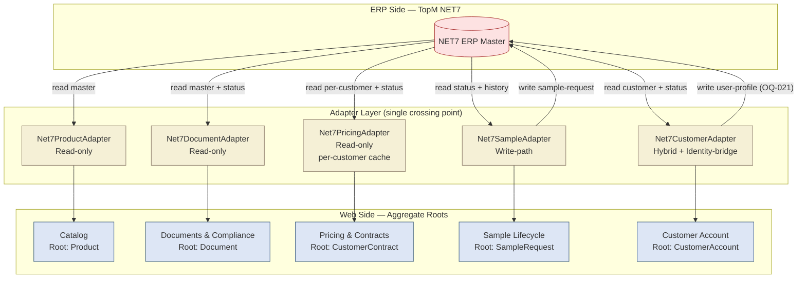
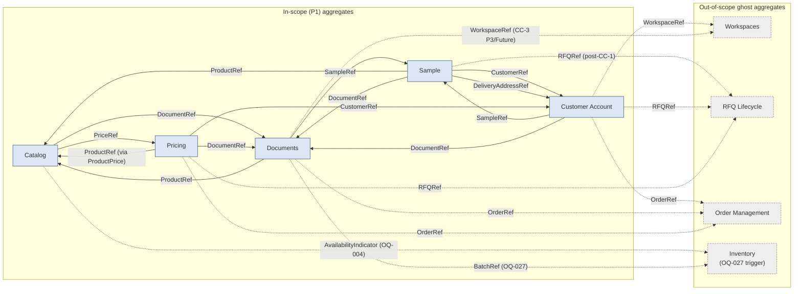

# Adapter Topology — AOT Procurement Platform

## 1. Purpose

Visual reference for the 5-adapter topology between **NET7** and the AOT web platform, the Web/ERP ownership boundary, and the 23 cross-aggregate references that wire the 5 P1 aggregate sketches together. Sprint-1-Closeout artefact P4 of 5+3 mandatory items; primary onboarding visual for Sprint 2 *ERP Boundary Design* coordination.

The two Mermaid diagrams (§2 Adapter Topology, §4 Cross-Aggregate Reference Map) consolidate information that is otherwise scattered across the 5 aggregate sketches' §5 sections and `bounded-contexts.md` §5 pair-relationships. The Adapter Profiles table (§3) is the read-at-a-glance summary of the 5 adapters and their failure-mode tiers.

All structural choices in this document mirror the working hypotheses in the underlying aggregate sketches; resolution of `OQ-027` (BatchReference placement, `open-questions-master.md` CP-6) and `OQ-035` (Pricing aggregate-boundary, CP-4) may add an Inventory aggregate node and split the Pricing node into two, respectively.

## 2. Adapter Topology

The five adapters mediate every read and write across the Web/ERP boundary. NET7 sits in the ERP zone (top); the adapter layer is the only crossing point; the 5 P1 aggregate roots sit in the Web zone (bottom). No adapter has a write surface unless explicitly tagged.

Edge legend:

- **`NET7 → Adapter`** edges: read paths, including read-only-mirror status synchronisation (per `documents-compliance.md` and `pricing-contracts.md` §5 status-sync notation).
- **`Adapter → NET7`** edges: write paths. Only `Net7SampleAdapter` and `Net7CustomerAdapter` carry these. Pricing, Documents, and Catalog adapters have **no write surface** by construction (per `AGENTS.md` ERP Ownership Hard Rules; see `pricing-contracts.md` `INV-5`, `documents-compliance.md` `INV-5`, `catalog.md` `INV-6`).
- **`Adapter → Aggregate Root`** edges: the adapter is the only legal entry point into its corresponding aggregate from outside the Web zone.

## 3. Adapter Profiles Summary

| Adapter                | Type                                | Read Surface                                                         | Write Surface                                                                | Failure-Mode Tier                                                          |
|------------------------|-------------------------------------|----------------------------------------------------------------------|------------------------------------------------------------------------------|----------------------------------------------------------------------------|
| `Net7ProductAdapter`   | Read-only                           | product master, search-index ingest                                  | none — `INV-6` enforced                                                      | stale-cache + `last-synced-at` banner                                      |
| `Net7DocumentAdapter`  | Read-only                           | doc master, version history, file references, `RequiredDocumentSet`  | none — `INV-5` (read-only mirror)                                            | 3-tier: cache → fresh fetch → direct NET7-DMS link                         |
| `Net7PricingAdapter`   | Read-only, per-customer cache       | contracts, prices, MOQ, lead-time, payment-terms, validity dates     | **none** — `AGENTS.md` Hard Rule + `INV-5`. Idempotency by construction.     | 3-tier: stale-cache banner → "pricing temporarily unavailable" → **Order/RFQ flow blocked** |
| `Net7SampleAdapter`    | Write-path                          | sample status, history                                               | sample-request creation + state-machine transitions; idempotent token        | retry with correlation-token + escalation                                  |
| `Net7CustomerAdapter`  | Hybrid (Read + Write + Identity-bridge) | customer master, `ContractStatus`, user list                         | user-profile updates (per `OQ-021`); preferences + `AuthenticationCredential` **excluded** by `INV-5` (security-boundary) | mixed: stale-banner for ERP-sourced; auth-resilience for web-only           |

## 4. Cross-Aggregate Reference Map

23 outbound references from the 5 P1 aggregate sketches. Five reference targets are **out of scope** (not yet sketched): `Workspaces` (P2), `RFQ Lifecycle` (P2), `Order Management` (P2), and `Inventory` (hypothetical, gated by `OQ-027` / `OQ-001` / `OQ-004` per `open-questions-master.md` Group 2).

Edge convention:
- **Solid arrow** `-->` — reference to an in-scope (P1) aggregate.
- **Dashed arrow** `-.->` — reference to an out-of-scope ghost aggregate.

Edge counts:
- **13 solid edges** (in-scope to in-scope): Catalog→Documents/Pricing; Sample→Catalog/CustomerAccount(×2)/Documents; CustomerAccount→Sample/Documents; Documents→Catalog/Sample; Pricing→CustomerAccount/Catalog/Documents.
- **10 dashed edges** (in-scope to out-of-scope ghost): Catalog→Inventory; Sample→RFQ; CustomerAccount→Workspaces/RFQ/Order; Documents→Inventory/Order/Workspaces; Pricing→Order/RFQ.
- **23 total** ✓ (matches the count in `open-questions-master.md` §6 + per-aggregate §6 inventories).

If the diagram becomes unreadable in practice (e.g., on small screens), the fallback is to split into 5 per-source sub-diagrams (one rooted at each P1 aggregate, showing only its outbound references) — see backup plan in §5.

## 5. Ownership Boundary Notes

- **ERP-defined components** are the master records (product master, document master, contracts, customer master, sample-fulfilment state). They live in NET7 and are read-only on the web side. Lifecycle states are read-only-mirror — the web reflects NET7-driven transitions but never originates them. Examples: `ProductIdentifier`, `DocumentStatus`, `ContractStatus` (read-only-mirror), `PriceValidity` (read-only-mirror), `SampleStatus`. See `catalog.md` `INV-6`, `documents-compliance.md` `INV-5`, `pricing-contracts.md` `INV-5`, `sample.md` `INV-6`, `customer-account.md` `INV-6`.
- **Shared components** are ERP-emitted hints augmented with web-side mappings (controlled vocabularies, presentation flags, scope-mapping rules). Examples: `Application` (ERP raw → web facet vocabulary), `Category` (web-defined taxonomy with ERP hints), `DocumentScope` (raw ERP scope → web completeness rules), `UserRole` (`AGENTS.md` persona vocabulary mapping).
- **Web-only components** live entirely in the web database with no ERP counterpart. They appear only in the **Customer Account** aggregate (`UserPreferences`, `AuthenticationCredential`) and in some web-only future aggregates (`Workspaces`). The `Pricing & Contracts` aggregate is the strictest: 13 components, 0 Shared, 0 Web-only — every component is ERP-defined per `AGENTS.md` Hard Rule on pricing logic.
- **Security-boundary** components are a Web-only sub-class subject to `INV-5` (security-boundary) in `customer-account.md` — they never propagate to NET7 under any code path. `AuthenticationCredential` is the canonical example. Logs reject credential serialization; the adapter contract excludes them at compile time.
- **Backup plan if §4 diagram becomes unreadable**: split into 5 per-source sub-diagrams, one rooted at each P1 aggregate (Catalog out-edges, Sample out-edges, …). Each sub-diagram has 3–5 outbound edges and renders comfortably on small screens. Trade-off: loses the consolidated view but gains readability.

## 6. References

- [`aggregates/catalog.md`](./aggregates/catalog.md) — `Net7ProductAdapter` profile, 3 outbound cross-aggregate references.
- [`aggregates/sample.md`](./aggregates/sample.md) — `Net7SampleAdapter` profile (first write-path), 5 outbound references.
- [`aggregates/customer-account.md`](./aggregates/customer-account.md) — `Net7CustomerAdapter` profile (hybrid + identity-bridge), 5 outbound references; security-boundary `INV-5`.
- [`aggregates/documents-compliance.md`](./aggregates/documents-compliance.md) — `Net7DocumentAdapter` profile, 5 outbound references; 3-tier failure-mode source.
- [`aggregates/pricing-contracts.md`](./aggregates/pricing-contracts.md) — `Net7PricingAdapter` profile (per-customer cache, business-process-blocking failure mode), 5 outbound references; `AGENTS.md` Hard Rule structurally enforced.
- [`bounded-contexts.md`](./bounded-contexts.md) — §5 pair-relationships; classifies each cross-aggregate edge (Customer/Supplier, Conformist, Partnership, ACL).
- [`capability-map.md`](./capability-map.md) — §3 capability inventory; adapter-to-capability mapping (e.g., CAP-002 ↔ `Net7ProductAdapter` search-index, CAP-006/007 ↔ `Net7PricingAdapter`).
- [`open-questions-master.md`](./open-questions-master.md) — single source of truth for the 23 cross-aggregate refs and the OQ register that gates the topology (especially `OQ-001`/`OQ-004`/`OQ-027` for Inventory placement, `OQ-017`/`OQ-035` for aggregate-boundary decisions).
- [`../risks/master-data-risk-register.md`](../risks/master-data-risk-register.md) — adapter-failure-mode realities (`MDR-005` broken doc links → 3-tier fallback, `MDR-018` sync-lag → business-process-blocking).
- [`../workflow.md`](../workflow.md) — operational context for the adapter-implementation workflow (Sprint-2 implementation phase per §15 PR Review Sequence after PR #17 merges).
- [`../../AGENTS.md`](../../AGENTS.md) — engineering charter; ERP Ownership Rules; ERP Integration Rules. Source of the hard-rule constraints structurally encoded across all 5 adapter profiles.
- *Future*: `docs/adr/0002` (Domain-Patterns ADR, Sprint-1-Closeout P5a) and `docs/adr/0003-erp-boundary-rules.md` (Sprint-1-Closeout P5b) will formalise the adapter contract specification and the boundary rules sketched here.
