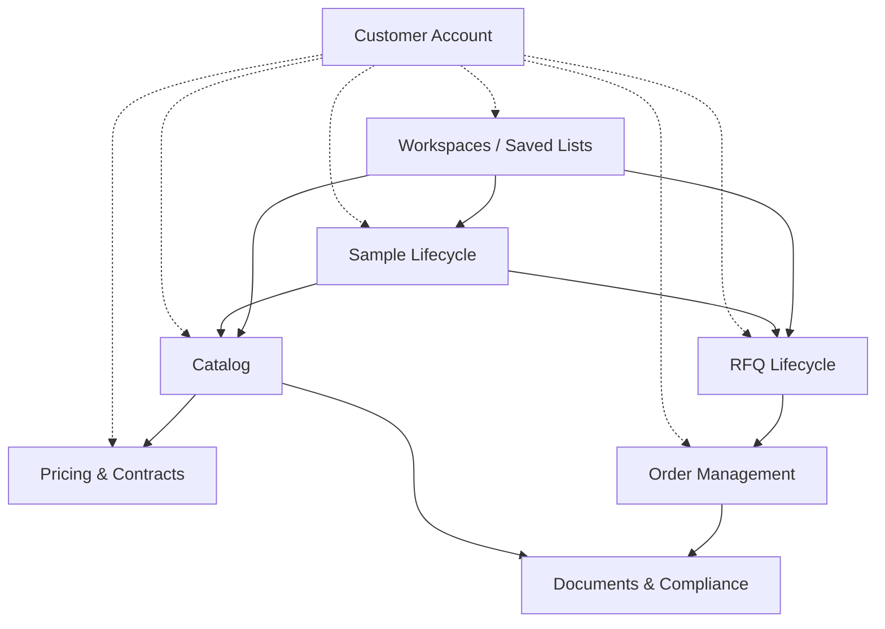

# Bounded Contexts — AOT Procurement Platform

## 1. Purpose

This document maps the AOT Digital Procurement Platform to eight working bounded contexts and assigns ownership across the web platform and the ERP **TopM NET7**. It is the entry point for all subsequent Sprint-1 domain-modeling tasks (Capability Map, Ubiquitous Language Glossary, Aggregate Sketches). The audience is engineering — current and future — and the handover-readiness goal of `AGENTS.md` applies.

All claims in this document are **working hypotheses** until validated through the Sprint-0 discovery streams (`business-discovery.md`, `erp-discovery.md`) and the Sprint-2 ERP boundary review.

## 2. Methodology

- **DDD context mapping** is the method. Each context has a clear purpose, key entities, and explicit relationships to other contexts.
- **Ownership is classified as Web / ERP / Shared.** *Shared* means the context spans both sides — ERP remains source of truth for everything `AGENTS.md` lists under ERP Ownership Rules; the web platform holds UX, sessions, search, dashboards, and workflows. The bridge between the two is always an isolated adapter (`apps/api/src/infrastructure/erp/adapters/*`, per ADR 0001 §2.5).
- **Hypotheses are explicit.** Where a claim is not yet validated by discovery, it is labelled `Hypothesis:` or `Open question:`. Claims about NET7 capabilities are particularly open and must not be assumed without ERP-discovery evidence.
- **Validation hooks.** Each context lists open questions that point at specific clusters in `business-discovery.md` (customer side) or `erp-discovery.md` (vendor side). Sprint-1 follow-ups (Capability Map, Glossary, Aggregate Sketches) will deepen each context; this document only sets the high-level frame.

## 3. Context Map

The diagram below shows the eight contexts and their relationships. Arrow convention:

- **Solid arrow `-->`** — data dependency at runtime (one context reads or transforms data from another).
- **Dashed arrow `-.->`** — identity / scope dependency (one context scopes the other through customer identity or session navigation).



ASCII fallback (edge list, in case Mermaid does not render):

```
Customer Account  -.->  Catalog                 (identity scope)
Customer Account  -.->  Pricing & Contracts     (identity scope)
Customer Account  -.->  Sample Lifecycle        (identity scope)
Customer Account  -.->  RFQ Lifecycle           (identity scope)
Customer Account  -.->  Order Management        (identity scope)
Customer Account  -.->  Workspaces / Saved Lists (identity scope)

Catalog           -->   Pricing & Contracts     (data dependency)
Catalog           -->   Documents & Compliance  (data dependency)
Sample Lifecycle  -->   Catalog                 (data dependency)
Sample Lifecycle  -->   RFQ Lifecycle           (data dependency)
RFQ Lifecycle     -->   Order Management        (data dependency)
Order Management  -->   Documents & Compliance  (data dependency)
Workspaces        -->   Catalog                 (data dependency)
Workspaces        -->   Sample Lifecycle        (data dependency)
Workspaces        -->   RFQ Lifecycle           (data dependency)
```

## 4. Contexts

### a. Catalog

- **Purpose**: Browse, search, compare, and inspect AOT's organic raw materials catalog with INCI / CAS / botanical / application metadata. Primary surface for buyer discovery and SEO.
- **Ownership**: Shared. ERP owns master product data, specifications, INCI/CAS, certifications and availability signals (per `AGENTS.md` ERP Ownership Rules). The web platform owns the search index, faceting, comparison UX, and SEO surface; web never duplicates ERP business logic.
- **Key Entities**: Product, Variant, Specification, Application, Origin, AvailabilitySignal.
- **Upstream / Downstream**: Upstream — ERP master data (external). Downstream — Pricing & Contracts, Documents & Compliance, Sample Lifecycle, Workspaces.
- **V1 Priority**: P1 (per `procurement-hypotheses.md` §9 — product search and details).
- **Open Questions**:
  - Open question: Are *Variants* first-class entities in NET7 or expressed as Product attributes? (`erp-discovery.md` §3.c)
  - Open question: Is INCI a primary search facet for buyers, or secondary to product name? (`business-discovery.md` §3.a, §3.b)
  - Open question: How is the web search index kept in sync with ERP master data — push, pull, scheduled? (`erp-discovery.md` §3.f)
  - Open question: How granular is availability data — exact stock, banded ("Low / Available / Made-to-order"), or absent? (`erp-discovery.md` §3.d, `procurement-hypotheses.md` §6 *Availability Confidence*)

### b. Pricing & Contracts

- **Purpose**: Surface customer-specific prices, MOQs, and payment terms based on contractual relationships. Read-only on the web side.
- **Ownership**: ERP-only on the write path; web is read-only via Anti-Corruption Layer adapter. `AGENTS.md` hard rule: *never duplicate ERP pricing logic, never move pricing into frontend*. ERP remains source of truth.
- **Key Entities**: Price, Contract, MOQ, PaymentTerms, PriceTier.
- **Upstream / Downstream**: Upstream — Customer Account (identity scope), Catalog (product reference). Downstream — RFQ Lifecycle, Order Management.
- **V1 Priority**: P1 (price visibility on product detail and dashboard, per `procurement-hypotheses.md` §9).
- **Open Questions**:
  - Open question: How are time-validity and price volatility (organic-product seasonality) represented? (`erp-discovery.md` §3.c, §3.d)
  - Open question: Are sample-stage prices distinguished from contract prices in NET7, or always contract-based? (`erp-discovery.md` §3.e)
  - Open question: How fresh do prices need to be at read time — minutes, hours, daily? (`erp-discovery.md` §3.f, `business-discovery.md` §3.g)

### c. Documents & Compliance

- **Purpose**: Surface SDS, COA, TDS, certificates, and allergen/kosher/halal statements with version awareness; show document-completeness indicators in catalog UX.
- **Ownership**: Shared. ERP holds source documents and batch-document linkage. The web platform owns discovery UX, completeness indicators, version display, and download tracking. No business logic copied from ERP.
- **Key Entities**: Document, DocumentType (SDS / COA / TDS / Certificate), BatchDocument, DocumentVersion.
- **Upstream / Downstream**: Upstream — Catalog (per-product), Order Management (per-batch). Downstream — UX consumers.
- **V1 Priority**: P1 (per `procurement-hypotheses.md` §9 — *documents*).
- **Open Questions**:
  - Open question: How are versioned per-batch COAs accessible — by product, by batch, by order? (`erp-discovery.md` §3.d)
  - Open question: Are document URLs stable references or signed/short-lived links? (`erp-discovery.md` §3.b, §3.h)
  - Open question: Do customers expect bulk-download per project (e.g., all docs for an Anti-Aging-Serum workspace)? (`business-discovery.md` §3.f)

### d. Sample Lifecycle

- **Purpose**: Initiate, track, and convert sample requests; preserve project context (e.g., "Anti Aging Serum", "Functional Beverage") to enable sample-to-RFQ conversion.
- **Ownership**: Shared. The web platform owns request UX, project-context tagging, status display, and conversion-to-RFQ. ERP owns fulfillment, dispatch, and billing of the physical sample.
- **Key Entities**: SampleRequest, SampleOrder, ApplicationProject, SampleStatus.
- **Upstream / Downstream**: Upstream — Catalog (product reference), Customer Account (identity), Workspaces (project context). Downstream — RFQ Lifecycle, Order Management.
- **V1 Priority**: P1 (per `procurement-hypotheses.md` §9 — *sample requests*).
- **Open Questions**:
  - Open question: Does NET7 model "sample request" as its own entity today, or as a special order? (`erp-discovery.md` §3.c, §3.e)
  - Open question: Which status events trigger customer notifications, and from which side? (`erp-discovery.md` §3.f)
  - Open question: How do customers communicate sample-to-decision feedback today (formal form, email, or no formal channel)? (`business-discovery.md` §3.d)
  - Open question: Is *one-click* sample request realistic against NET7 today, or do mandatory fields force a multi-step flow? (`procurement-hypotheses.md` §5 Stage 4, `erp-discovery.md` §3.e)

### e. RFQ Lifecycle

- **Purpose**: Capture quote requests, manage quote validity windows, and support sample-to-RFQ conversion plus side-by-side comparison.
- **Ownership**: Shared. Web owns RFQ UX, comparison view, conversion from Sample. ERP owns the pricing engine, contract application, and the official quote document.
- **Key Entities**: RFQRequest, Quote, QuoteValidity, RFQLineItem.
- **Upstream / Downstream**: Upstream — Sample Lifecycle, Catalog, Customer Account, Pricing & Contracts. Downstream — Order Management.
- **V1 Priority**: P2 (per `procurement-hypotheses.md` §9 — *RFQ workflow*).
- **Open Questions**:
  - Open question: Does NET7 expose a quote-creation API, or is quote generation purely a back-office workflow today? (`erp-discovery.md` §3.e)
  - Open question: What quote-validity windows are typical, and how should expired quotes be handled in UX? (`business-discovery.md` §3.e)
  - Open question: How are multi-supplier quote comparisons performed today on the customer side — internally in Excel, in an e-procurement tool? (`business-discovery.md` §3.e)

### f. Order Management

- **Purpose**: Provide order placement, history view, delivery tracking, and batch-document linkage in the customer dashboard.
- **Ownership**: Shared. Web owns the dashboard UX, history aggregation, and reorder workflows. ERP owns order processing, logistics, and batch traceability.
- **Key Entities**: Order, OrderLine, DeliveryTracking, BatchAssignment.
- **Upstream / Downstream**: Upstream — RFQ Lifecycle, Customer Account. Downstream — Documents & Compliance (per-batch docs).
- **V1 Priority**: P2 (per `procurement-hypotheses.md` §9 — *dashboard, reorder*).
- **Open Questions**:
  - Open question: What level of delivery-tracking detail does NET7 expose — carrier and tracking-id only, or staged events? (`erp-discovery.md` §3.d)
  - Open question: How are partial-shipment / multi-batch fulfilments represented in the order model? (`erp-discovery.md` §3.c)
  - Open question: Do customers expect reorder-from-history as one-click, or always with explicit RFQ? (`business-discovery.md` §3.h, `procurement-hypotheses.md` §5 Stage 6)

### g. Customer Account

- **Purpose**: Authenticate users, scope content per customer, manage profile and account preferences. Identity backbone of the platform.
- **Ownership**: Shared. Web owns sessions, auth, dashboards, and account preferences. ERP owns master customer data, contractual relationships, and pricing tier.
- **Key Entities**: Customer, Contact, AccountPreferences, AuthSession, ContactRole.
- **Upstream / Downstream**: Upstream — auth provider (external). Downstream — Catalog, Pricing & Contracts, Sample Lifecycle, RFQ Lifecycle, Order Management, Workspaces.
- **V1 Priority**: P1 (gate to all authenticated content).
- **Open Questions**:
  - Open question: How are multiple contacts per customer handled — SSO, individual logins, or role-based shared accounts? (`erp-discovery.md` §3.b, `business-discovery.md` §3.b)
  - Open question: Does NET7 expose a stable customer-ID that survives mergers, renames, or successor accounts? (`erp-discovery.md` §3.c)
  - Open question: Are customer-account changes (new contact, address) writable via API, or only via the TopM portal? (`erp-discovery.md` §3.e)

### h. Workspaces / Saved Lists

- **Purpose**: Project-based product lists (e.g., "Anti Aging Serum", "Functional Beverage", "Organic Skincare") that link a customer's recurring formulation work to product discovery, sample requests, and RFQs. Web-only artefact.
- **Ownership**: Web-only. Not represented in NET7. Persistence in the web database. Per `AGENTS.md`, this is web-platform-owned (UX / sessions / workflows).
- **Key Entities**: Workspace, ProductList, ProjectTag, WorkspaceMember.
- **Upstream / Downstream**: Upstream — Catalog (product references), Customer Account (ownership scope). Downstream — Sample Lifecycle, RFQ Lifecycle.
- **V1 Priority**: P2 (per `procurement-hypotheses.md` §6 *Saved Lists*).
- **Open Questions**:
  - Open question: Should workspaces be private-per-user or shareable-per-customer-org? (`business-discovery.md` §3.b, §3.h)
  - Open question: Do customers want workspace metadata (formulation type, status, target launch date) beyond a simple product list? (`business-discovery.md` §3.a)
  - Open question: Is collaborative editing (multiple contacts editing one list) needed in V1, or is single-owner sufficient?

## 5. Context Pair Relationships

DDD relationship types used below: *Customer/Supplier*, *Conformist*, *Anti-Corruption Layer (ACL)*, *Shared Kernel*, *Partnership*, *Open Host Service*, *Published Language*. Relationships involving ERP-owned data carry an **ACL on the web side by default**, since `AGENTS.md` mandates isolated adapters and prohibits coupling to ERP shape.

1. **Catalog → Pricing & Contracts**: *Customer/Supplier* with **ACL**. Catalog displays prices to support buyer comparison; ERP supplies the price model. Web translates ERP price representation into UX-relevant fields. *Hypothesis: ACL is sufficient; no shared kernel needed. Validation: `erp-discovery.md` §3.c, §3.d.*
2. **Catalog → Documents & Compliance**: *Customer/Supplier*. Catalog UX surfaces document-completeness indicators per product; document identities come from ERP. *Hypothesis: documents reachable by stable product reference; validation: `erp-discovery.md` §3.d.*
3. **Customer Account → Catalog**: *Conformist*. The authenticated session scopes catalog views (contracted product range, customer-specific filters). Catalog's product model is the source; account context layers on top. No ERP coupling on this edge.
4. **Customer Account → Pricing & Contracts**: *Customer/Supplier* with **ACL**. The web identity must be bridged to the ERP customer ID before any price read. *Hypothesis: web auth maps 1:1 to NET7 customer; validation: `erp-discovery.md` §3.b, §3.c.*
5. **Sample Lifecycle → RFQ Lifecycle**: *Partnership*. Sample data should auto-populate RFQ creation (`procurement-hypotheses.md` §5 Stage 5). Both contexts share the assumption that an *ApplicationProject* persists across the transition. *Open question: which side owns the conversion contract — web orchestration only, or ERP-side state?*
6. **Sample Lifecycle → Catalog**: *Conformist*. Sample requests reference catalog products; the Sample context conforms to Catalog's product identifiers and specification model.
7. **RFQ Lifecycle → Order Management**: *Partnership*. Quote acceptance triggers order creation; web and ERP co-design the transition contract. *Hypothesis: quote-to-order is an ERP-side transition surfaced read-only on the web; validation: `erp-discovery.md` §3.e, §3.f.*
8. **Order Management → Documents & Compliance**: *Customer/Supplier*. Order lines reference batch-specific documents (per-batch COA, per-batch certificates). *Hypothesis: ERP exposes batch-document linkage; validation: `erp-discovery.md` §3.d.*
9. **Workspaces / Saved Lists → Catalog**: *Conformist*. Workspaces store product references; conform to Catalog's product identifiers. No ERP coupling; pure web-side identity reference.
10. **Customer Account → Workspaces / Saved Lists**: *Customer/Supplier*. Workspaces are owned and scoped by the customer account. Web-only relationship; no ERP boundary involved.

## 6. Open Architecture Questions

The questions below feed Sprint-1 follow-up tasks and the Sprint-2 ERP boundary review.

For follow-up domain-modeling tasks:

- **Capability Map (Task 1.2)**: Which capabilities live in which context? Where does a capability span multiple contexts and require explicit orchestration?
- **Ubiquitous Language Glossary (Task 1.3)**: Which terms are AOT-internal vs. industry-standard (INCI, CAS, COA)? Which terms have web-side vs. ERP-side meaning that must be reconciled?
- **Aggregate Sketches (Task 1.4 ff.)**: For each P1 context, what is the consistency boundary? Where are eventual-consistency seams acceptable?

Open from this document:

- **Pricing in Catalog vs. separate context.** Is *Pricing & Contracts* better folded into *Catalog* for V1 simplicity, or kept separate to honour ERP ownership boundaries cleanly? *Hypothesis: keep separate; ERP isolation is the priority over folder count.*
- **Workspaces really web-only?** Could TopM later introduce a "project" entity that we would need to federate with? *Open question for `erp-discovery.md` §3.d roadmap discussion.*
- **Sample-to-RFQ conversion ownership.** Web-side orchestration over two ERP write operations, or a single ERP-side transition? Affects Partnership vs. Customer/Supplier classification of the §5 #5 edge.
- **Documents context boundary.** Should regulatory-statement generation (allergen, kosher/halal) be its own sub-context, or remain inside *Documents & Compliance*?
- **Customer Account vs. Identity Provider.** Is the auth provider an upstream context, or just infrastructure? *Hypothesis: infrastructure; revisit if SSO requirements emerge.*

## 7. References

- [`AGENTS.md`](../../AGENTS.md) — engineering charter, hard rules, ERP ownership rules, ERP integration rules.
- [`procurement-hypotheses.md`](../procurement-hypotheses.md) — §6 Procurement UX, §7 ERP Assumptions, §9 Version 1 Feature Priorities.
- [`business-discovery.md`](../business-discovery.md) — customer interview guide (Buyer, Product Developer, Quality Manager).
- [`erp-discovery.md`](../erp-discovery.md) — TopM/NET7 interview guide (Technical, Account/Commercial).
- [`adr/0001-stack-and-deployment.md`](../adr/0001-stack-and-deployment.md) — stack and deployment, §2.5 ERP adapter topology.
- [`ROADMAP.md`](../../ROADMAP.md) — sprint plan, Sprint 1 — Domain Modeling, Sprint 2 — ERP Boundary Design.
